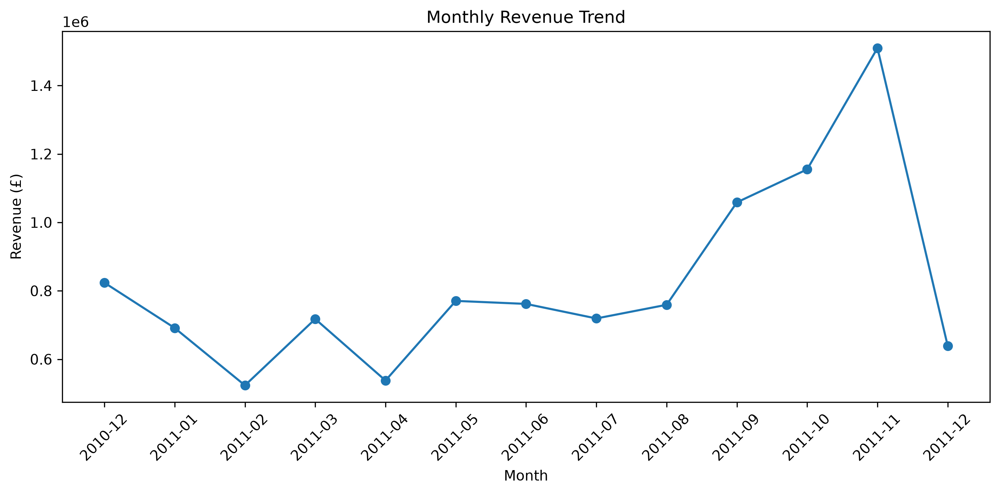
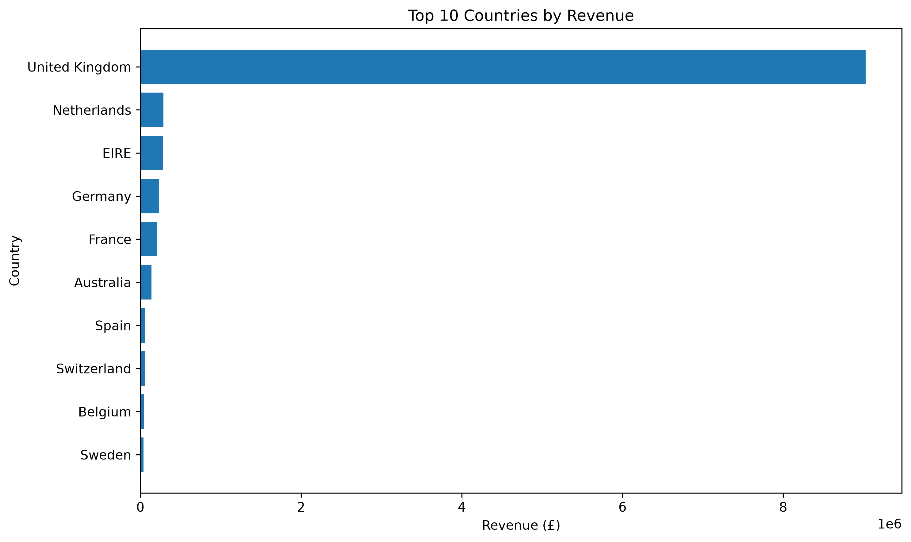

# E-commerce Sales Analysis

## Overview
This project analyzes real-world online retail transaction data to explore sales trends, country-level revenue, order volume, and average order value (AOV).

The analysis uses Python for data cleaning and visualization, and SQL for business-oriented aggregation and reporting.

## Dataset
- Source: UCI Machine Learning Repository — Online Retail Dataset
- Records: 541,909 transactions
- Key fields:
  - InvoiceNo
  - StockCode
  - Description
  - Quantity
  - InvoiceDate
  - UnitPrice
  - CustomerID
  - Country

## Data Cleaning
For sales analysis, the data was filtered to:
- Keep only records with `Quantity > 0`
- Keep only records with `UnitPrice > 0`
- Exclude cancelled invoices beginning with `C`
- Exclude rows with missing product descriptions

A `Revenue` field was created as:

`Revenue = Quantity × UnitPrice`

Transactions with missing `CustomerID` were retained for aggregate sales analysis and excluded only when customer-level analysis requires an identifier.

## Visualizations

### Monthly Revenue Trend

### Top 10 Countries by Revenue

## Key Analysis

### 1. Monthly Revenue
- Calculated monthly revenue from cleaned transaction data
- Revenue increased sharply from September through November 2011
- November 2011 generated the highest monthly revenue in the dataset
- December 2011 is a partial month and should not be directly compared with full months

### 2. Country-Level Sales
- Ranked countries by total revenue and order volume
- The United Kingdom generated the largest share of revenue, driven primarily by a much higher number of orders
- The Netherlands and Australia had relatively high average order values despite much lower order volumes

### 3. SQL Analysis
- Used SQL to calculate:
  - Total revenue by country
  - Distinct order counts
  - Average order value (AOV)
  - Monthly revenue trends
 
 ## Tools Used
- Python
- Pandas
- Matplotlib
- SQL
- SQLite
- Git / GitHub

### Key Findings

- Electronics category generates the highest revenue
- Product category is the strongest predictor of purchase amount
- Time variables (month/day) have limited impact
- Top users contribute a significant portion of total revenue

## Tools Used

- R
- ggplot2
- Data aggregation techniques
- Linear regression modeling

## Project Purpose

This project demonstrates end-to-end data analysis skills, including:

- Data generation
- Data cleaning
- Visualization
- Business insights
- Predictive modeling
